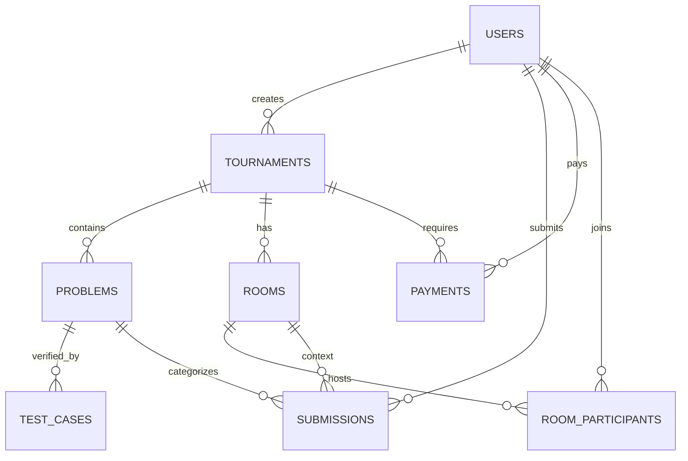

# Database Design - Coding Battle Platform

## Entity Relationship Summary

### 1. Users
- Core identity storage.
- Tracks `rating` (ELO-like) and `total_solved` for global rankings.

### 2. Tournaments
- Central event entity.
- Linked to `users` (creator) and `problems`.
- Has states: `upcoming` (registration), `active` (ongoing), `completed`.

### 3. Problems & Test Cases
- `problems` are linked to tournaments or are global.
- `test_cases` store inputs and expected outputs.
- `points` define the weight of each problem.

### 4. Rooms & Participants
- `rooms` are UUID-based instances of a tournament.
- `room_participants` is a junction table tracking user progress within a specific room instance.

### 5. Submissions
- Every code attempt is logged.
- Tracks Judge0 metadata (`execution_time`, `memory`, `status`).
- Stores the actual `source_code`.

### 6. Payments
- Tracks Razorpay checkout attempts.
- Links users to tournaments through a verified `order_id` and `payment_id`.

## Table Schema (Mermaid Visualization)

